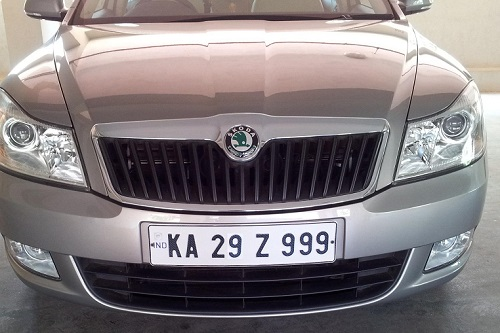
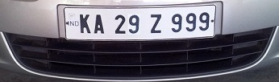

# 🚗 Number Plate Recognition System

A simple, lightweight Flask web app that detects vehicle number plates using OpenCV, crops the plate region, and extracts the plate text using Tesseract OCR.

Below is an example using the sample image `google_images/133.jpeg` and its detected result `static/results/133_plate.jpg`.

---

## 🖼️ Original Vehicle Image



## 🏷️ Detected Number Plate



---

## ⚡ How to run

1. Create a virtual environment and install dependencies

```bash
python -m venv venv
# Activate the environment
# Windows (cmd): venv\Scripts\activate
# Windows (PowerShell): venv\Scripts\Activate.ps1
# macOS / Linux: source venv/bin/activate
pip install -r requirements.txt
```

2. Start the Flask app

```bash
python app.py
```

3. Open the site

Visit `http://127.0.0.1:5000/` in your browser, upload an image, and see the recognition results.

---

## 🛠️ Tesseract OCR

This project uses Tesseract OCR via the Python wrapper `pytesseract`. You must install the Tesseract engine separately on your system.

- Windows (recommended build):

  https://github.com/UB-Mannheim/tesseract/wiki

- After installing, ensure `tesseract.exe` is on your PATH or update the path in `detect.py`:

```python
# Example (Windows):
pytesseract.pytesseract.tesseract_cmd = r'C:\Program Files\Tesseract-OCR\tesseract.exe'
```

---

## Notes

- The README references local images by relative paths — keep `google_images/133.jpeg` and `static/results/133_plate.jpg` in the repository if you want them to display on GitHub.
- If you need GPU accelerated OpenCV or a specific build, adjust `requirements.txt` accordingly.

---

If you'd like I can also add a "Features & Screenshots" section with badges, or produce a single-line repo description suitable for GitHub's short description field.
